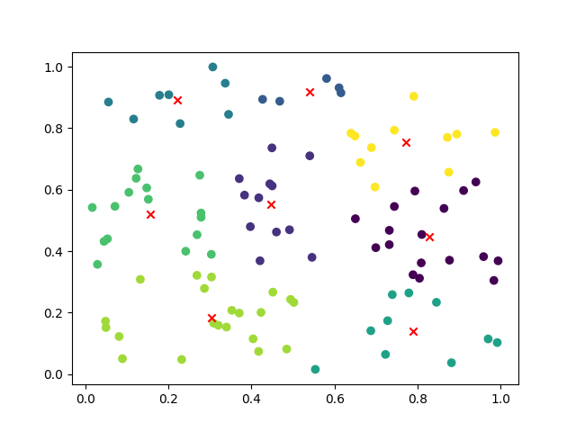

K-means clustering is a popular unsupervised machine learning algorithm used for clustering data points into groups. It aims to partition the data into K clusters, where each data point belongs to the cluster with the nearest mean value.

The algorithm works by iteratively assigning data points to the nearest cluster centroid and updating the centroids based on the mean of the assigned data points. This process continues until convergence, where the centroids no longer change significantly or a maximum number of iterations is reached.

K-means clustering is widely used in various domains, such as image segmentation, customer segmentation, and anomaly detection. It is relatively simple to implement and computationally efficient, making it a popular choice for clustering tasks.

To use K-means clustering, you typically need to specify the number of clusters (K) and the initial positions of the centroids. The algorithm then iteratively optimizes the cluster assignments and centroid positions to minimize the within-cluster sum of squares.

